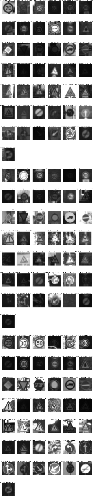

# Writeup for Traffic Sign Recognition

Welcome, you're reading it! And, here is a link to my [project code](https://github.com/rjlutz/CarND-Traffic-Sign-Classifier-Project/blob/master/Traffic_Sign_Classifier.ipynb)

The goals of this project are the following:
* Load the data set (see below for a visual summary of the data set)
* Explore, summarize and visualize the data set
* Design, train and test a model architecture
* Use the model to make predictions on new images
* Analyze the softmax probabilities of the new images
* Summarize the results with this written report

For reference, here's the [rubric](https://review.udacity.com/#!/rubrics/481/view).
### Data Set Summary & Exploration

I used the numpy library to calculate summary statistics of the traffic signs data set. Here's the summary:

* Number of training examples = 34799
* Number of testing examples = 12630
* Image data shape = (32, 32, 3)
* Number of classes = 43

#### 2. Exploratory visualization of the dataset.

Here is an exploratory visualization of the data set.

These are representative examples of the original input, grouped by the training set, the validation set and the test set:

### Design and Test a Model Architecture

#### 1. Preprocessing

Initial attempts at a model resulted in low validation results. Based on the suggestions provided in the instructions for this project, grayscale conversion was performed to improve the validation rate.

Here are the same representative images as shown earlier, after the grayscale adjustment (again showing representative images for all signs in the training, validation and test sets):

Subsequently, further improvements were sought. Adaptive histogram equalization was attempted, but didn't result in any considerable improvements, that I could tell. Next, as I observed that there were many training images with low contrast, I applied gamma adjustment to those images with the lowest contrast. This provided better validation results.

After gamma adjustment to the images with low contrast (again showing the same representative images for all signs in the training, validation and test sets):

Finally, as required by the project specification, the data was normalized to improve training and recognition.

At this point, I achieved validation and test results of 93% or better. I did not pursue adding dropout or augmentation with altered data to the model.

#### 2. Model Architecture

The LeNet architecture was used as the basis for the model. The recommendations in the project instructions were followed to adjust the model's geometry to work with the traffic sign training data.

My traffic sign model consisted of the following layers:

| Layer         		|     Description	        					|
|:---------------------:|:---------------------------------------------:|
| L1: Input         		| 32x32x3 Grayscale, Contrast Enhanced, Normalized (with 3 RGB channels maintained)   							|
| L1: Convolution 5x5     	| 1x1 stride, valid padding, output 28x28x6 	|
| RELU					|												|
| L1: Max pooling	      	| 2x2 stride, input 28x28x6, outputs 14x14x6, same padding  				|
| L2: Convolution 5x5 | 1x1 stride, valid padding, output 10x10x16 |
| L2: RELU  | |
| L2: Max Pooling | 2x2 stride, input 10x10x16, output 5x5x16, same padding |
| L2: Flatten | input 5x5,15, output 400|
| L3: Fully connected | input 400, output 120|
| L4: Fully connected | input 120, output 84|
| L5: Fully connected | input 84, output 43|

#### 3. Training

Initially, I used the values provided in the starter code for batch size, number of epochs, and hyper-parameters. In the end, all values were maintained, except for the number of epochs. This value was increased to improve validation and test accuracy. This adjustment  to EPOCHS was successful and resulted in validation and test results which exceed 93%.

#### 4. Tuning the model

Once the preprocessing flow was done, I was able to achieve accuracy around 91-92%. By increasing the number of epochs, I was able to achieve validation and test accuracies greater than 93%. At this point, I accepted the model and didn't pursue adding dropout or fake data.

My final model results were:
* training set accuracy of 100%
* validation set accuracy of 94.5%
* test set accuracy of 93.7%

A well known architecture was chosen. Here are responses to the prompts in the writeup template:
* What architecture was chosen? __LeNet__
* Why did you believe it would be relevant to the traffic sign application? __Similar in nature to MNIST character recognition__
* How does the final model's accuracy on the training, validation and test set provide evidence that the model is working well? __Accuracies reported at higher than 93%.__

### Test a Model on New Images

#### 1. Choose five or more German traffic signs found on the web.

Initially, I tried six images I found on the web. The results were poor. In order to validate my model and approach, I retrieved eight more images from [here]( http://www.adcidl.com/pdf/Germany-Road-Traffic-Signs.pdf). These results were better. I decided to maintain the combined set of fourteen images for this test step.

In the original set of six, I suspect that variations in the images made recognition difficult. For example, some are rectangular and not not square, and the backgrounds are different than those of the training set in others. I also suspect that, had I used augmented (/fake) data, I would have achieved higher accuracy since the training process would not favor the most popular (/frequent) signs, as much.

Here are fourteen German traffic signs that I found on the web (both images and those from the pdf document):

#### 2. Discuss the model's predictions

Here are the prediction results of the web images:

| Image			        |     Prediction	        					|
|:---------------------:|:---------------------------------------------:|
| Stop | Priority road|
| Vehicles over 3.5 metric tons prohibited| Vehicles over 3.5 metric tons prohibited |
| Pedestrians | General Caution|
| Yield| Yield|
| Priority road| Priority Road|
| Turn right ahead | Turn Right Ahead|
| Road work | Road Work|
| Bicycles crossing| Bicycles crossing|
| 60 km/h| No Passing |
| Pedestrians| General Caution|
| Rondabout mandatory      		| Roundabout mandatory	|
| Stop     			| No passing for vehicles over 3.5 metric tons 										|
| Yield					| Keep Right		|
| 100 km/h	      		| 50 km/h|

The model was able to correctly guess 7 of the 14 traffic signs, which gives an accuracy of 50%.

#### 3. Describe how certain the model is when predicting on each of the fourteen new images by looking at the softmax probabilities.

<pre>
Sign:  Stop
  0.866278 - Priority road
  0.133329 - Traffic signals
  0.000378 - Stop
  0.000015 - Speed limit (80km/h)
  0.000000 - Road work

Sign:  Vehicles over 3.5 metric tons prohibited
  1.000000 - Vehicles over 3.5 metric tons prohibited
  0.000000 - Speed limit (20km/h)
  0.000000 - Speed limit (30km/h)
  0.000000 - Speed limit (50km/h)
  0.000000 - Speed limit (60km/h)

Sign:  Pedestrians
  1.000000 - General caution
  0.000000 - Pedestrians
  0.000000 - Traffic signals
  0.000000 - Right-of-way at the next intersection
  0.000000 - Road narrows on the right

Sign:  Yield
  1.000000 - Yield
  0.000000 - Speed limit (20km/h)
  0.000000 - Speed limit (30km/h)
  0.000000 - Speed limit (50km/h)
  0.000000 - Speed limit (60km/h)

Sign:  Priority road
  1.000000 - Priority road
  0.000000 - No passing
  0.000000 - No entry
  0.000000 - Ahead only
  0.000000 - Speed limit (80km/h)

Sign:  Turn right ahead
  1.000000 - Turn right ahead
  0.000000 - Speed limit (20km/h)
  0.000000 - Speed limit (30km/h)
  0.000000 - Speed limit (50km/h)
  0.000000 - Speed limit (60km/h)

Sign:  Road work
  1.000000 - Road work
  0.000000 - Speed limit (20km/h)
  0.000000 - Speed limit (30km/h)
  0.000000 - Speed limit (50km/h)
  0.000000 - Speed limit (60km/h)

Sign:  Bicycles crossing
  1.000000 - Bicycles crossing
  0.000000 - Bumpy road
  0.000000 - Turn left ahead
  0.000000 - Road work
  0.000000 - Ahead only

Sign:  Speed limit (60km/h)
  1.000000 - No passing
  0.000000 - No entry
  0.000000 - No passing for vehicles over 3.5 metric tons
  0.000000 - Yield
  0.000000 - Dangerous curve to the right

Sign:  Pedestrians
  1.000000 - General caution
  0.000000 - Road work
  0.000000 - Right-of-way at the next intersection
  0.000000 - Roundabout mandatory
  0.000000 - Beware of ice/snow

Sign:  Roundabout mandatory
  1.000000 - Roundabout mandatory
  0.000000 - Priority road
  0.000000 - No passing
  0.000000 - End of no passing by vehicles over 3.5 metric tons
  0.000000 - No passing for vehicles over 3.5 metric tons

Sign:  Stop
  0.448092 - No passing for vehicles over 3.5 metric tons
  0.309570 - Priority road
  0.242338 - No passing
  0.000000 - Speed limit (50km/h)
  0.000000 - Speed limit (100km/h)

Sign:  Yield
  0.857260 - Keep right
  0.142663 - Roundabout mandatory
  0.000077 - Go straight or right
  0.000000 - End of no passing
  0.000000 - Speed limit (30km/h)

Sign:  Speed limit (100km/h)
  0.999994 - Speed limit (50km/h)
  0.000006 - Priority road
  0.000000 - Speed limit (80km/h)
  0.000000 - Keep right
  0.000000 - Speed limit (100km/h)
  </pre>

For the second through eleventh and fourteenth images, the model is relatively sure that it has the right label (probabilities very close to 1.00). However, in only eight of those eleven cases, was the model correct in predicting the label.  For the first, twelveth and thirteenth test, the probability was lower AND the predictions were incorrect. Improving the model, through the addition of dropout and augmented data, could serve to improves these predictions.

### (Optional) Visualizing the Neural Network
#### 1. Discussion

The visual output for layers one and two of the model, when stimulated by the __Vehicles over 3.5 metric tons prohibited__ sign, can be seen in [my project code page](https://github.com/rjlutz/CarND-Traffic-Sign-Classifier-Project/blob/master/Traffic_Sign_Classifier.ipynb).

The feature images show that the outlines of a circular sign boundary and the outlines of various features of a box truck (roof, taligate, wheels, cab, etc.) will activate layers one and two.
